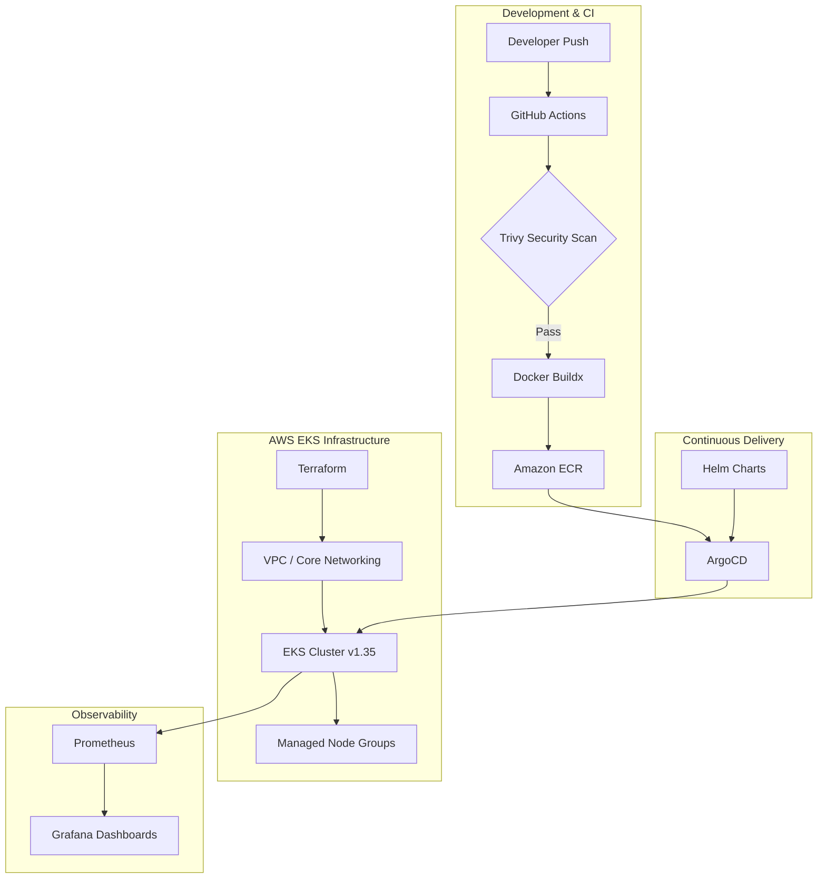

# Online Boutique: Cloud-Native DevSecOps Modernization

[](https://github.com/dragerzw/online-boutique-end-to-end/actions)
[](https://aws.amazon.com/eks/)
[](https://www.terraform.io/)
[](https://argoproj.github.io/cd/)

This repository showcases a professional modernization of the Google **Online Boutique** microservices application, transitioned from legacy GKE to a hardened, automated **AWS EKS v1.35** environment. The project implements industry-standard DevSecOps practices, featuring a "True Green" CI/CD pipeline, comprehensive security scanning, and GitOps-based continuous delivery.

---

## 🏗️ System Architecture

Our architecture leverages **Infrastructure as Code (IaC)** and a **GitOps** model to ensure 100% reproducibility and auditability.



---

## 🛠️ Technical Stack

| Category | Technology |
| :--- | :--- |
| **Cloud Infrastructure** | AWS (VPC, EKS, ECR, IAM OIDC) |
| **Orchestration** | Kubernetes 1.35 (EKS Optimized) |
| **Infrastructure as Code** | Terraform (Modular Design) |
| **CI/CD Pipeline** | GitHub Actions (OIDC-based Authentication) |
| **Security Scanning** | Aqua Security Trivy (Vulnerability Management) |
| **Continuous Delivery** | ArgoCD (GitOps Pull Model) |
| **Monitoring** | Prometheus & Grafana (Kube-Prometheus-Stack) |
| **Microservices** | Go, .NET, Node.js, Python, Java |

---

## 🛡️ DevSecOps & Security Posture

This project prioritizes a **Security-First** approach:

1.  **Hardenened CI Gates:** No image is pushed to ECR without passing a mandatory **Trivy High/Critical scan**.
2.  **OIDC Authentication:** Eliminated the need for long-lived AWS IAM Access Keys by using GitHub Actions OIDC identity tokens to authenticate with AWS.
3.  **Risk Acceptance Logic:** Implemented a refined `.trivyignore` manifest to explicitly manage and document accepted risks in upstream base images.
4.  **Least Privilege:** EKS pods utilize **IAM Roles for Service Accounts (IRSA)** to interact with AWS resources securely.

---

## 💡 High-Impact Lessons & Challenges

Building a production-ready EKS environment presented several high-level technical challenges that required a deep-dive into AWS IAM and Kubernetes internals.

### 1. The "Invisible Admin" (EKS Access Entries)
**Challenge:** After provisioning the cluster, the IAM identity used by Terraform (DevOpsIAM) were locked out of the Kubernetes API, resulting in "cluster unreachable" errors during Helm deployments.
**Resolution:** Leveraged **EKS Access Entries** and explicitly enabled `enable_cluster_creator_admin_permissions`. This highlighted the shift in EKS v1.30+ from the legacy `aws-auth` ConfigMap to the more robust EKS-native access management API.

### 2. Achieving "True Green" Security
**Challenge:** Base images for Node.js and Python contained several "High" severity vulnerabilities (e.g., glibc, orjson) that were unpatchable in upstream repositories, causing the CI pipeline to fail consistently.
**Resolution:** Implemented a **Risk Acceptance Strategy** using a version-controlled `.trivyignore` manifest. This allowed us to explicitly document and accept specific CVEs while maintaining a hard-fail gate for any NEW vulnerabilities, ensuring security posture is never compromised by drift.

### 3. CI/CD OIDC Identity Federation
**Challenge:** Traditional methods of using long-lived `AWS_ACCESS_KEY_ID` secrets are a major security liability and against AWS Best Practices.
**Resolution:** Optimized the pipeline to use **GitHub OIDC Identity Federation**. By creating an IAM Role with a trust relationship to the GitHub OIDC provider, we transitioned to a "zero-secret" architecture for AWS authentication.

---

## 🚀 Quick Start (EKS)

### 1. Provision Infrastructure
```bash
cd terraform
terraform init
terraform apply -auto-approve
```

### 2. Bootstrap GitOps (ArgoCD)
```bash
kubectl apply -f argocd/application.yaml
```

### 3. Configure Local Access
```bash
aws eks update-kubeconfig --region us-east-1 --name online-boutique
```

### 4. Access Dashboards
- **ArgoCD:** Retrieve the NLB URL and admin secret to monitor GitOps synchronization.
- **Monitoring:** Port-forward the Grafana service to view real-time cluster health.

---


---
*Maintained by Drager Mandiya| Professional DevOps Portfolio*
